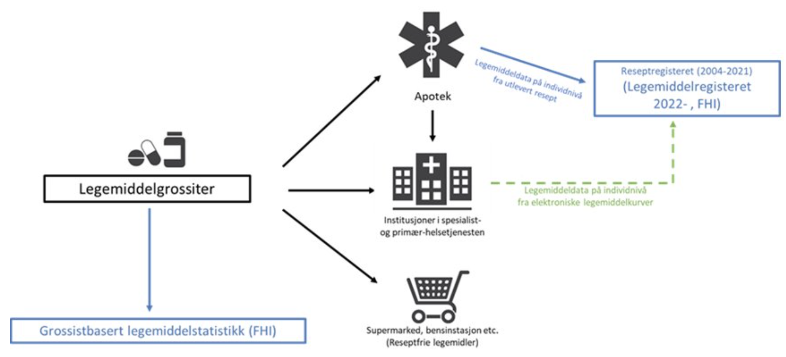

### Legemiddeldata fra institusjon til Legemiddelregisteret (LMDI)

Komplette og oppdaterte helsedata på legemidler er tilgjengelig for analyse og forskning med tanke på å forbedre kvalitet, styring, helseovervåking, beredskap og kunnskapsforvaltning i helsetjenesten

#### Mål

Samle inn legemiddeldata på individnivå fra polikliniske og innlagte pasienter i institusjon til Legemiddelregisteret (LMR). Som et ledd i dette utvikles det en implementasjonsguide (IG) basert på en felles informasjonsmodell og HL7 FHIR (dette dokumentet). Dette skal benyttes for innsending av data fra institusjon til LMR ved hjelp av datadeling (sikret REST API).

#### Kontaktpersoner

Yngve, Line, Espen
