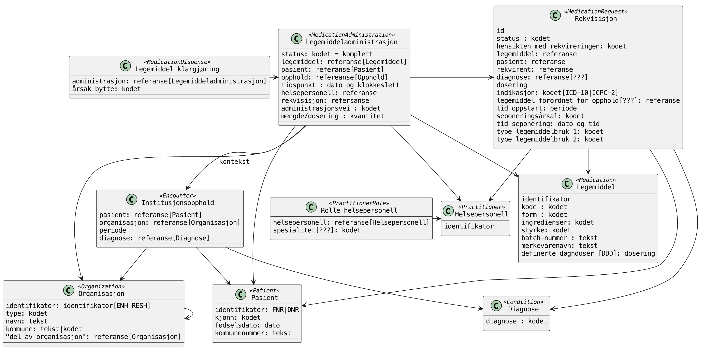

# Modeller

Modellene benytter [PlantUML](https://github.com/plantuml/plantuml). For eksperimentering, sjekk [online PlantUML-editor](https://www.plantuml.com/plantuml/uml/).

## Utkast for diskusjon

Utkast, under stadig forandring! Stereotypen sier hvilken FHIR-ressurs som benyttes, f.eks. ```<<Patient>>```




